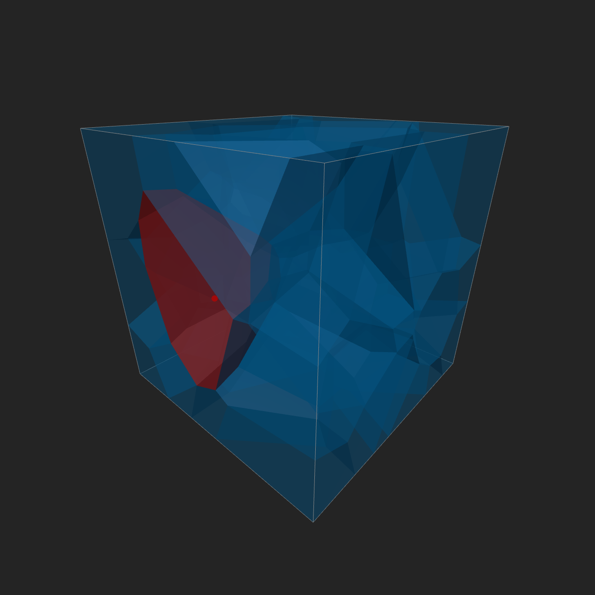
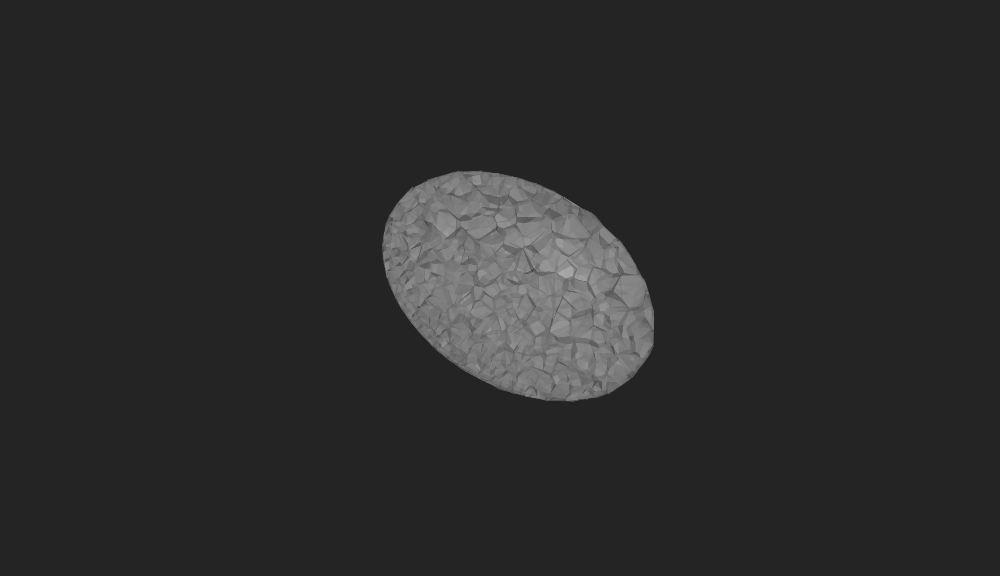
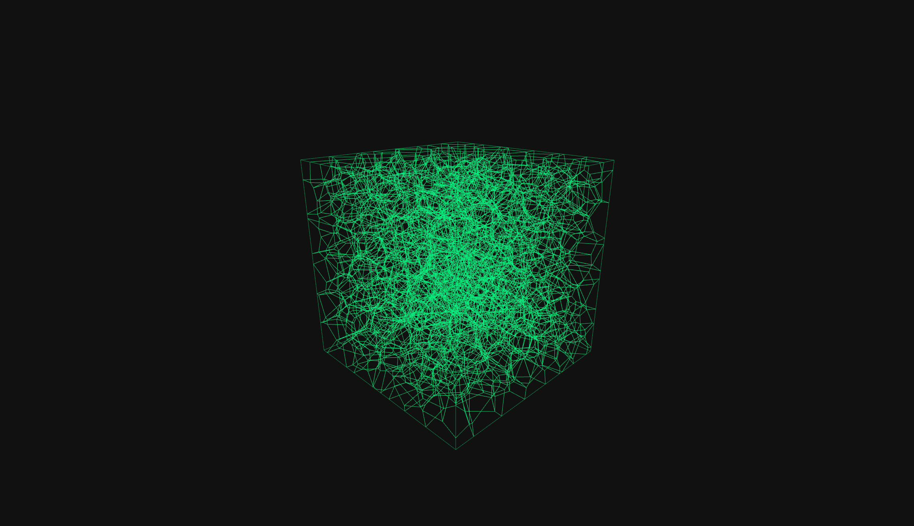
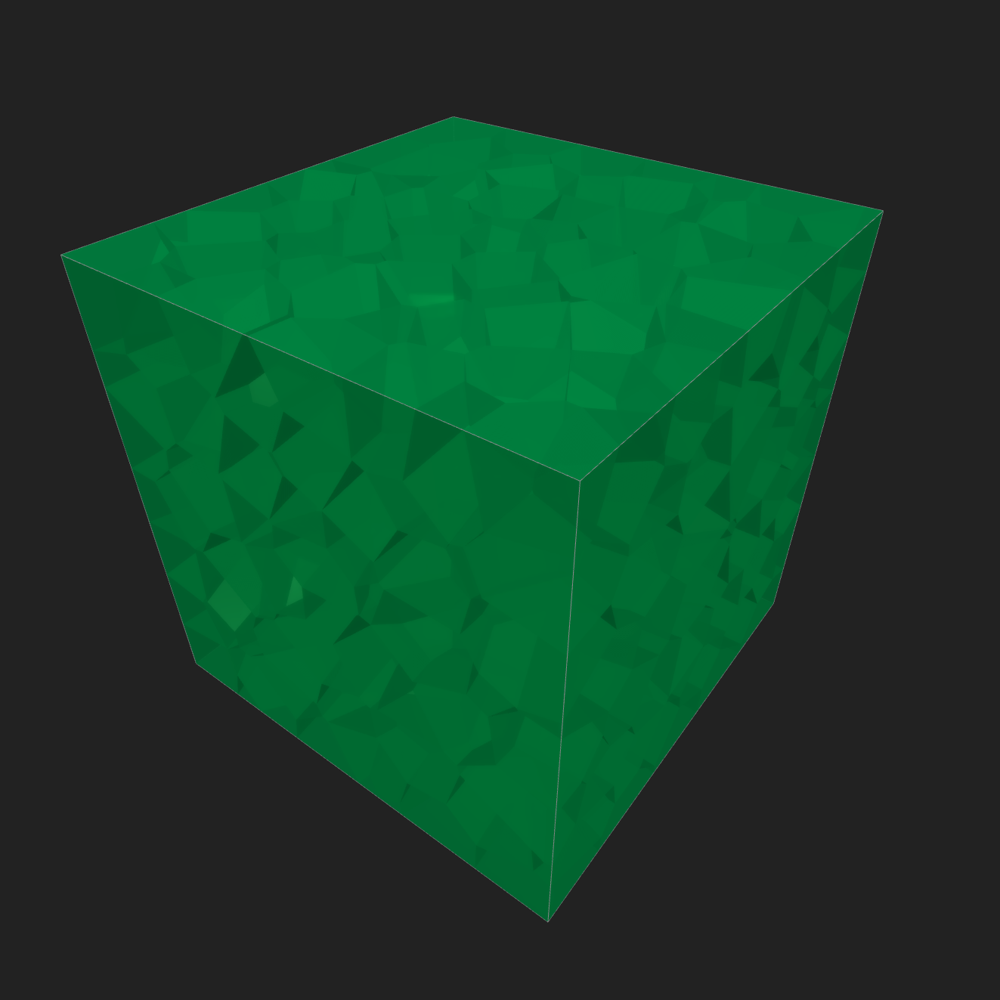
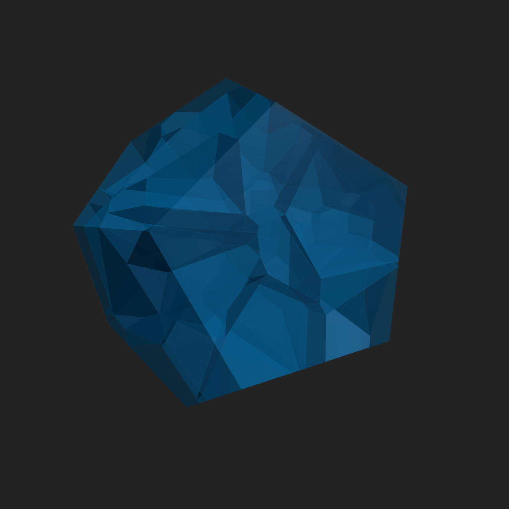
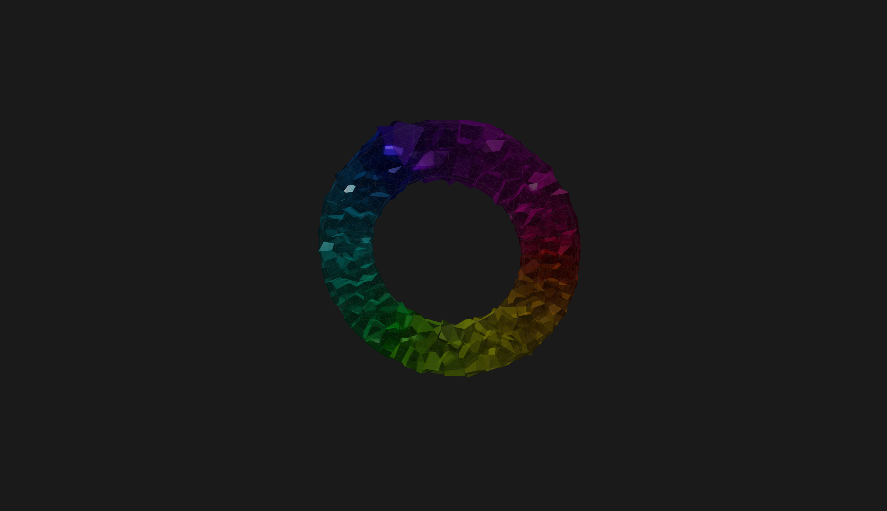
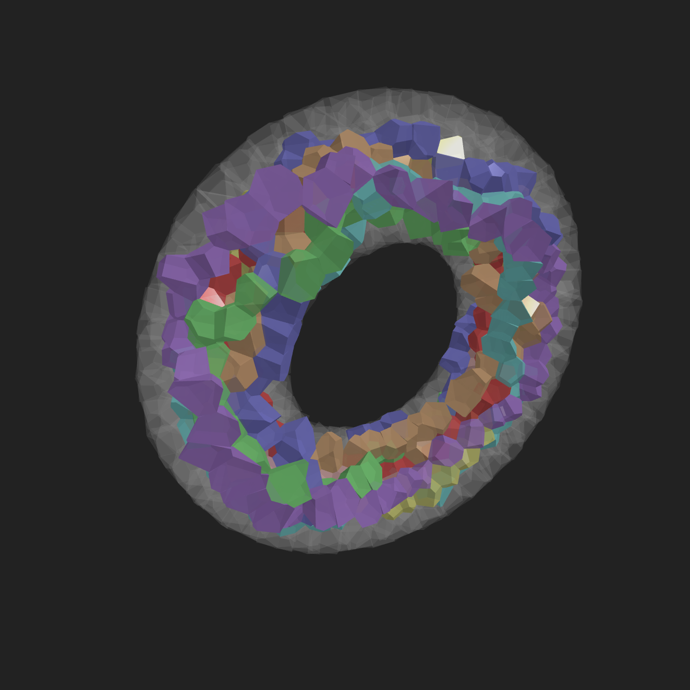
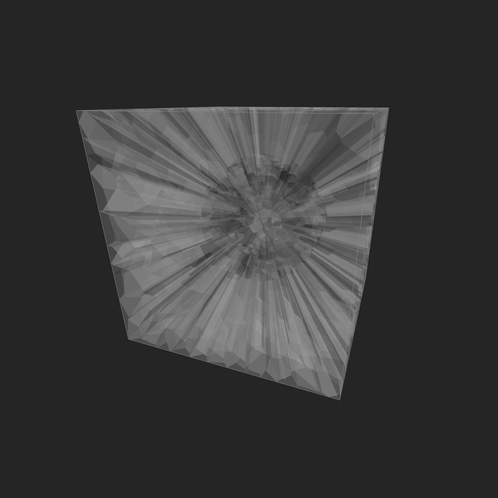

# vorothree

[](https://crates.io/crates/vorothree)
[](https://github.com/mdt-re/vorothree/actions/workflows/test.yml)
[](https://github.com/mdt-re/vorothree/actions/workflows/deploy.yml)
[](https://github.com/mdt-re/vorothree/actions/workflows/docs.yml)


Rust library for 3D Voronoi tessellations, designed to be used in Rust as well as compiled to WebAssembly (TypeScript interface). It provides a flexible and feature-rich implementation to calculate the individual cells by a clipping procedure based on the generating points, the bounding box and possible walls. The tessellation struct takes a spatial algorithm to calculate the nearest neighbours efficiently and a cell struct which manages cell data and the clipping algorithm. The combination of spatial algorithm and cell can then be matched to the specific application and distribution of generators. A few of [interactive examples](https://mdt-re.github.io/vorothree/) are shown below.
<table>
  <tr>
    <td align="center">
      <a href="https://mdt-re.github.io/vorothree/?example=moving_cell">
        <br />
      </a>
    </td>
    <td align="center">
      <a href="https://mdt-re.github.io/vorothree/?example=walls">
        <br />
      </a>
    </td>
    <td align="center">
      <a href="https://mdt-re.github.io/vorothree/?example=benchmark">
        <br />
      </a>
    </td>
    <td align="center">
      <a href="https://mdt-re.github.io/vorothree/?example=relaxation">
        <br />
      </a>
    </td>
  </tr>
  <tr>
    <td align="center">
      <a href="https://mdt-re.github.io/vorothree/?example=transition">
        <br />
      </a>
    </td>
    <td align="center">
      <a href="https://mdt-re.github.io/vorothree/?example=granular_flow">
        <br />
      </a>
    </td>
    <td align="center">
      <a href="https://mdt-re.github.io/vorothree/?example=pathfinding">
        <br />
      </a>
    </td>
    <td align="center">
      <a href="https://mdt-re.github.io/vorothree/?example=distributions">
        <br />
      </a>
    </td>
  </tr>
</table>

## WASM and Web Usage

This library is designed to directly compile to WASM. To build the project for web usage:
```bash
wasm-pack build --target web
```
Consult the [www](www/) folder for examples and more details on how to use with TypeScript and in a web environment.


## Development

More information on the [tests](tests/), [benchmarks](benches/) and [examples](examples/) is in their respective directories. They can be run by:
```bash
cargo test
cargo bench
cargo example --example <example>
```
Contributing is highly appreciated via [Issues](https://github.com/mdt-re/vorothree/issues) and [Pull Requests](https://github.com/mdt-re/vorothree/pulls).

## License

Licensed under either of

 * Apache License, Version 2.0
   ([LICENSE-APACHE](LICENSE-APACHE) or <http://www.apache.org/licenses/LICENSE-2.0>)
 * MIT license
   ([LICENSE-MIT](LICENSE-MIT) or <http://opensource.org/licenses/MIT>)

at your option.